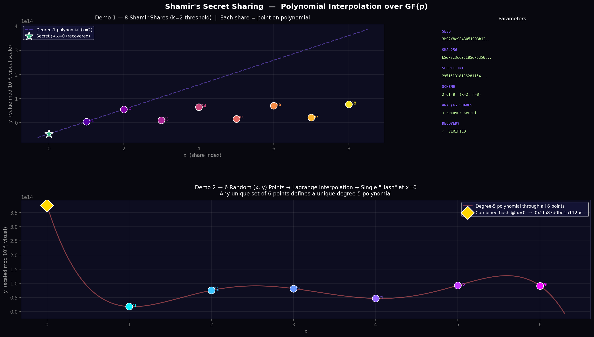

# Shamir's Secret Sharing — Demo

A from-scratch Python implementation of **Shamir's Secret Sharing** (SSS) with two visual demos showing how polynomial interpolation over a finite field works.

No external crypto libraries — just Python + NumPy + Matplotlib.



---

## What is Shamir's Secret Sharing?

A cryptographic scheme (Adi Shamir, 1979) that splits a secret into **n shares** such that any **k of them** (the *threshold*) can reconstruct the original secret — but **k−1 or fewer shares reveal nothing**.

The math: construct a random degree-(k−1) polynomial `f` over `GF(p)` with `f(0) = secret`. Each share is a point `(x, f(x))` on the curve. Lagrange interpolation recovers `f(0)` from any k points.

---

## Project Structure

```
shamir_demo/
├── shamir.py       # Core implementation + demos + plotting
└── README.md       # This file
```

---

## Usage

### Run both demos and generate the plot

```bash
python shamir.py
```

Outputs:
- Console: share values, recovery verification, combined hash
- File: `shamir_demo.png` — visualization of both demos

### Use as a library

```python
from shamir import make_shares, recover_secret

import hashlib, secrets

# 1. Hash a secret
seed = secrets.token_hex(32)
h = hashlib.sha256(seed.encode()).hexdigest()
secret_int = int(h, 16) % (2**127 - 1)

# 2. Split into 5 shares, require 3 to recover
shares = make_shares(secret_int, k=3, n=5)
# → [(1, y1), (2, y2), (3, y3), (4, y4), (5, y5)]

# 3. Recover from any 3 shares
recovered = recover_secret(shares[:3])
assert recovered == secret_int  # ✓
```

---

## Demo 1 — Hash → Shamir → Plot

**What it does:**

1. Generate a random 32-byte seed (`secrets.token_hex`)
2. SHA-256 hash it → 256-bit hex string
3. Convert to integer, reduce mod prime `p = 2¹²⁷ − 1`
4. Build a `k=2`-of-`n=8` scheme (linear polynomial)
5. Plot all 8 `(x, y)` share points + the polynomial curve
6. Recover the secret from the first 2 shares and verify

**Why k=2 is interesting to plot:** a degree-1 polynomial is a line. You can visually see that any 2 points define the line, and the secret is the y-intercept at x=0.

---

## Demo 2 — Random (x,y) Points → Combined Hash

**What it does:**

1. Generate 6 random `(x, y)` points
2. Run Lagrange interpolation over all 6 (same code as recovery)
3. Evaluate at `x=0` → a single deterministic integer "combined hash"

**The insight:** this is Shamir reconstruction run in reverse conceptually. Given N arbitrary points, there is exactly one polynomial of degree ≤ N−1 passing through them. Its value at x=0 is a unique fingerprint of that point-set.

---

## Math Details

### Field: `GF(p)` where `p = 2¹²⁷ − 1`

All operations are integers mod this Mersenne prime. This ensures:
- **Exact arithmetic** — no floating point error
- **Information-theoretic security** — fewer than k shares are perfectly uniform

### Polynomial evaluation — Horner's method

```
f(x) = c₀ + c₁x + c₂x² + ... + c_{k-1} x^{k-1}
     = c₀ + x(c₁ + x(c₂ + ... + x·c_{k-1}))
```

### Lagrange interpolation at x=0

```
f(0) = Σᵢ yᵢ · Πⱼ≠ᵢ (0 − xⱼ)/(xᵢ − xⱼ)   (all mod p)
```

Modular inverse computed via Fermat's little theorem: `a⁻¹ ≡ aᵖ⁻² (mod p)`

---

## Requirements

```
python >= 3.10
numpy
matplotlib
```

Install:

```bash
pip install numpy matplotlib
```

---

## Security Notes

- **This is a demo** — not audited for production use
- The prime `p = 2¹²⁷ − 1` is sufficient for 128-bit secrets
- For real-world SSS, consider audited libraries (e.g. `tss` or hardware implementations)
- Share indices start at 1 — never use x=0 as a share (that's the secret itself)
